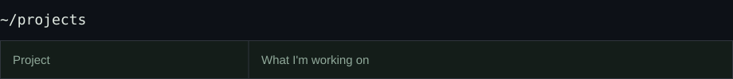
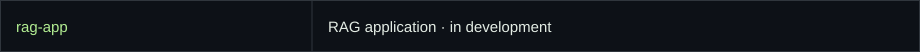
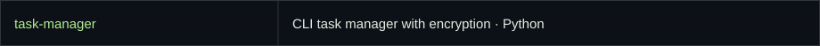
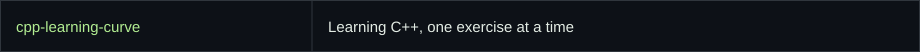
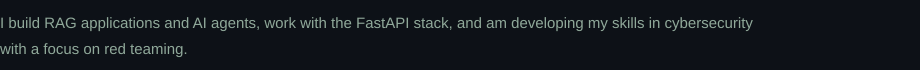
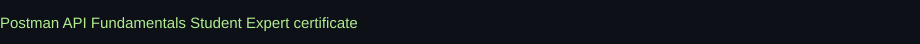

  <picture>
  <source media="(max-width: 600px)" srcset="./assets/profile-mobile.svg" />
  
  </picture>

  <a href="mailto:abdoalaabakry@gmail.com">Email</a> &nbsp; / &nbsp;
  <a href="https://www.linkedin.com/in/abd-alrhman-bakri-856585375/">LinkedIn</a> &nbsp; / &nbsp;
  <a href="https://github.com/Lonly-Tree?tab=repositories">Repositories</a>

  

<picture><source media="(max-width: 600px)" srcset="./assets/projects-heading-mobile.svg" /></picture> 
<a href="https://github.com/Lonly-Tree/rag-app"><picture><source media="(max-width: 600px)" srcset="./assets/project-rag-app-mobile.svg" /></picture></a> 
<a href="https://github.com/Lonly-Tree/task-manager"><picture><source media="(max-width: 600px)" srcset="./assets/project-task-manager-mobile.svg" /></picture></a> 
<a href="https://github.com/Lonly-Tree/cpp-learning-curve"><picture><source media="(max-width: 600px)" srcset="./assets/project-cpp-learning-curve-mobile.svg" /></picture></a> 

Beyond the terminal

<picture><source media="(max-width: 600px)" srcset="./assets/about-mobile.svg" /></picture>

<a href="./Postman%20-%20Postman%20API%20Fundamentals%20Student%20Expert%20-%202026-01-14.png"><picture><source media="(max-width: 600px)" srcset="./assets/certificate-mobile.svg" /></picture></a>

<!-- Edit profile.json and run python scripts/build_profile.py to update the artwork. -->
